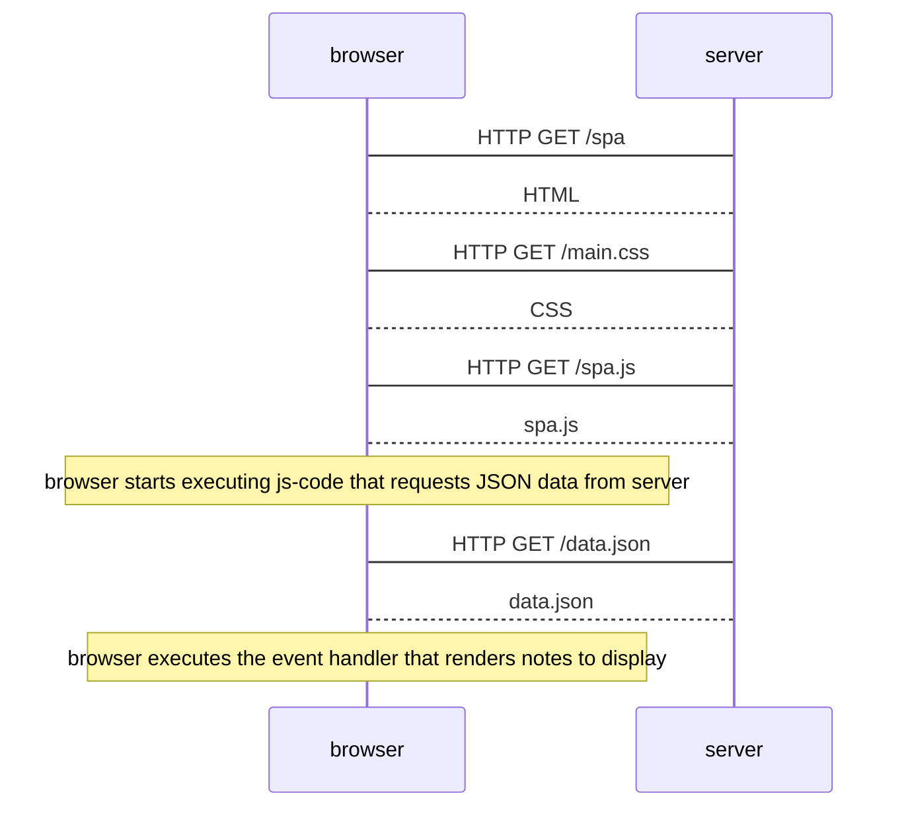

```mermaid
sequenceDiagram
participant browser
participant server
  browser->server: HTTP GET /spa
  server-->browser: HTML

  browser->server: HTTP GET /main.css
  server-->browser:CSS

  browser->server: HTTP GET /spa.js
  server-->browser:spa.js

  Note over browser: browser starts executing js-code that requests JSON data from server 

  browser->server: HTTP GET /data.json
  server-->browser: data.json

  Note over browser:  browser executes the event handler that renders notes to display
```