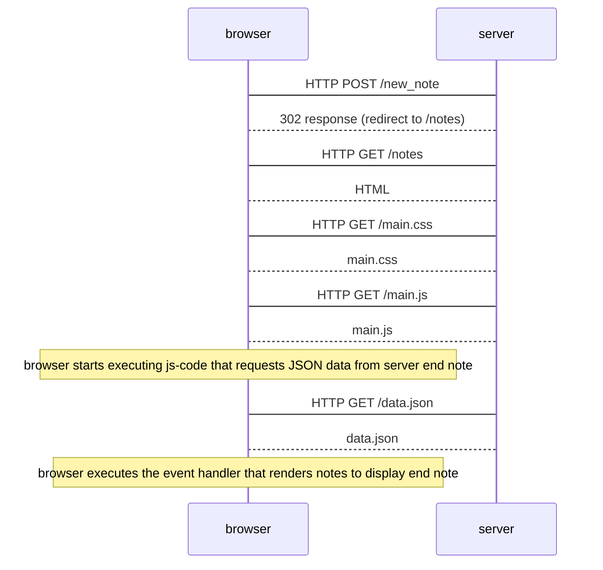

```mermaid
sequenceDiagram
participant browser
participant server
  browser->server: HTTP POST /new_note
  server-->browser: 302 response (redirect to /notes)

  browser->server: HTTP GET /notes
  server-->browser:HTML

  browser->server: HTTP GET /main.css
  server-->browser:main.css

  browser->server: HTTP GET /main.js
  server-->browser:main.js


  Note over browser: browser starts executing js-code that requests JSON data from server  end note

  browser->server: HTTP GET /data.json
  server-->browser: data.json

  Note over browser:  browser executes the event handler that renders notes to display end note
```